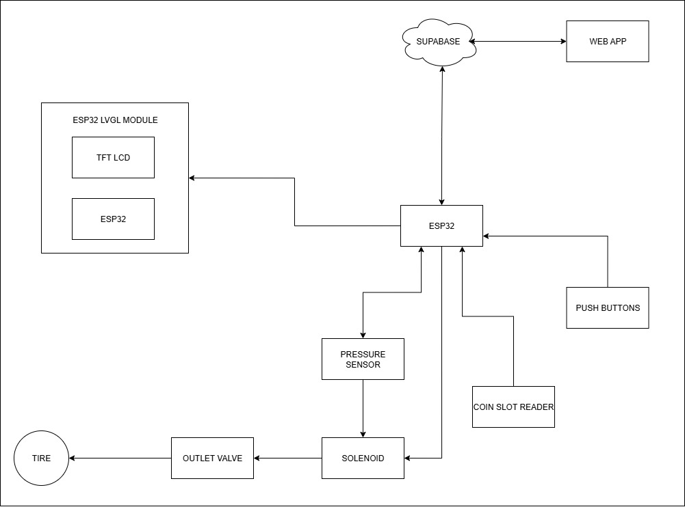

# Coin-Operated Smart Tire Air Pump Vending Machine

## Description

The Coin-Operated Smart Tire Air Pump Vending Machine is a microcontroller-driven, self-service system that provides a fast, safe, and user-friendly way to inflate vehicle tires. Perfect for public locations like vulcanizing shops, parking lots, terminals, and gas stations, it offers tire code lookup, DOT safety checks, and auto-stop inflation at a target PSI.

## Services

1. **Tire Code Info**
   - Input tire code (e.g., P215/65R15) via push-buttons
   - Displays recommended PSI from internal database
2. **DOT Code Check**
   - Input DOT code (e.g., 0718)
   - Calculates tire age and displays safety status
3. **Tire Inflation**
   - Live PSI updates on TFT display
   - Automatic stop at recommended or user-defined PSI

## System Architecture



## Hardware Requirements

- Microcontroller (e.g., Arduino Uno or similar)
- TFT display module
- Push-button inputs (up, down, select)
- Pressure sensor
- Coin acceptor mechanism
- Coin validation circuitry
- Solid State Relay (SSR) & Automatic Transfer Switch (ATS)
- Power supply and enclosure
- Wiring and connectors

## Software Requirements

- Arduino IDE (or PlatformIO)
- Required Arduino libraries:
  - TFT display library
  - Button debouncing library
  - Coin acceptor library (if applicable)
  - Sensor driver for pressure sensor

## Installation & Setup

1. **Clone the repository**
   ```bash
   git clone https://github.com/yourusername/smart-tire-air-pump.git
   cd smart-tire-air-pump
   ```
2. **Open in Arduino IDE**
   - Load the `.ino` file located in `src/`
3. **Configure hardware settings**
   - Adjust pin definitions in `config.h`
   - Update pricing, PSI database, and service enable flags
4. **Upload firmware**
   - Connect your microcontroller via USB
   - Upload the sketch

## Usage

1. **Power on** the machine.
2. **Select service** using the push-buttons.
3. **Insert coins**; total cost is displayed on the screen.
4. **Follow on-screen prompts** to input codes or start inflation.
5. **Connect the hose** and press “Start.”
6. **Machine auto-stops** once the target PSI is reached.
7. **Remove hose** and collect change (if any).

## Admin Control Panel

- Access via secure login on the TFT interface
- **Manage tire codes** and recommended PSI values
- **Modify service pricing**
- **Enable/disable features** (e.g., DOT check)
- **View audit logs** of usage and payments
- **Enter maintenance mode** to clear data

## Contributing

1. Fork the repository
2. Create a new branch (`git checkout -b feature/YourFeature`)
3. Commit your changes (`git commit -m "Add YourFeature"`)
4. Push to branch (`git push origin feature/YourFeature`)
5. Open a Pull Request

## License

This project is licensed under the MIT License. See [LICENSE](LICENSE) for details.
